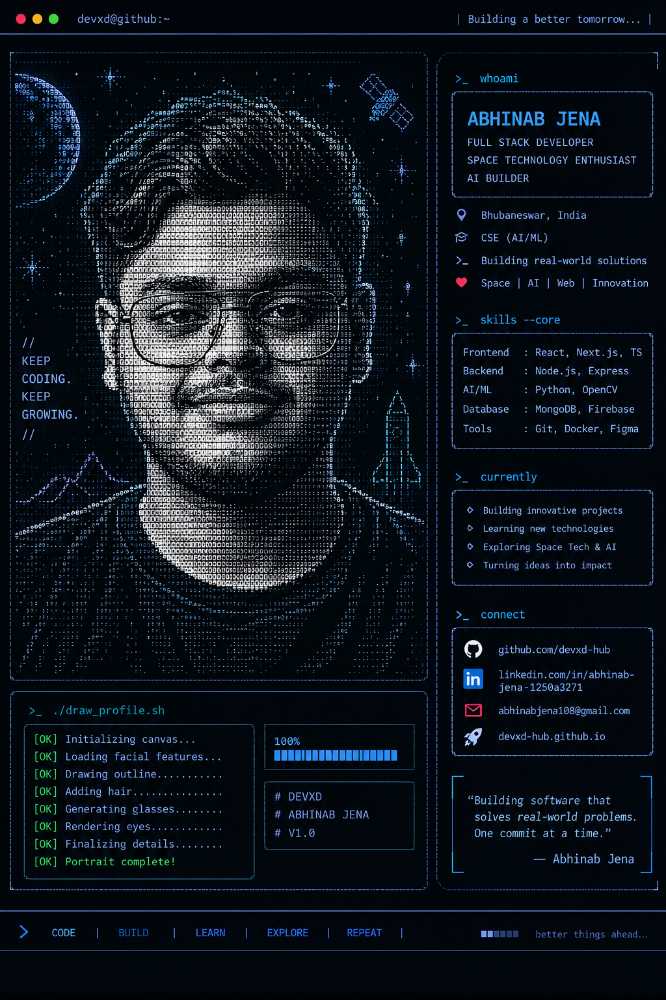

<!-- =========================================================
     TOP TERMINAL BAR
========================================================= -->

<table
  width="100%"
  border="0"
  cellspacing="0"
  cellpadding="6"
>
<tr>

<td align="left">
<code>●</code>
<code>●</code>
<code>●</code>
&nbsp;&nbsp;
<code>devxd@github:~</code>
</td>

<td align="right">
<code>| Building a better tomorrow... |</code>
</td>

</tr>
</table>

 

<!-- =========================================================
     MAIN TERMINAL INTERFACE
========================================================= -->

<table
  width="96%"
  border="1"
  cellspacing="0"
  cellpadding="12"
>
<tr>

<!-- =========================================================
     LEFT SIDE — ASCII PORTRAIT
========================================================= -->

<td
  width="62%"
  valign="top"
  align="center"
>

<h3 align="left">

<code>&gt; ./draw_profile.sh</code>

</h3>

 

<!-- STATIC ASCII PORTRAIT -->

  

<!-- DRAW STATUS PANEL -->

<table
  width="94%"
  border="1"
  cellspacing="0"
  cellpadding="8"
>

<tr>

<td width="62%" valign="top">

<pre>
[OK] Initializing canvas...
[OK] Loading facial features...
[OK] Drawing outline..........
[OK] Adding hair..............
[OK] Generating glasses.......
[OK] Rendering eyes...........
[OK] Finalizing details.......
[OK] Portrait complete!
</pre>

</td>

<td width="38%" valign="top">

<pre>
100%

████████████████
</pre>

 

<pre>
# DEVXD
# ABHINAB JENA
# V1.0
</pre>

</td>

</tr>

</table>

</td>

<!-- =========================================================
     RIGHT SIDE — TERMINAL PROFILE
========================================================= -->

<td
  width="38%"
  valign="top"
>

<h3>

<code>&gt;_ whoami</code>

</h3>

 

<table
  width="100%"
  border="1"
  cellspacing="0"
  cellpadding="12"
>

<tr>

<td>

<h2>

<code>ABHINAB JENA</code>

</h2>

<code>FULL STACK DEVELOPER</code>

 

<code>SPACE TECHNOLOGY ENTHUSIAST</code>

 

<code>AI BUILDER</code>

</td>

</tr>

</table>

 

<!-- PROFILE INFO -->

<table
  width="100%"
  border="0"
  cellspacing="0"
  cellpadding="7"
>

<tr>
<td>⌖</td>
<td><code>Bhubaneswar, India</code></td>
</tr>

<tr>
<td>⌘</td>
<td><code>CSE (AI/ML)</code></td>
</tr>

<tr>
<td>&gt;_</td>
<td><code>Building real-world solutions</code></td>
</tr>

<tr>
<td>♥</td>
<td><code>Space | AI | Web | Innovation</code></td>
</tr>

</table>

 

<!-- =========================================================
     SKILLS
========================================================= -->

<h3>

<code>&gt;_ skills --core</code>

</h3>

<table
  width="100%"
  border="1"
  cellspacing="0"
  cellpadding="10"
>

<tr>
<td>

<code>
Frontend&nbsp;&nbsp;: React, Next.js, TS
</code>

  

<code>
Backend&nbsp;&nbsp;&nbsp;: Node.js, Express
</code>

  

<code>
AI/ML&nbsp;&nbsp;&nbsp;&nbsp;: Python, OpenCV
</code>

  

<code>
Database&nbsp;&nbsp;: MongoDB, Firebase
</code>

  

<code>
Tools&nbsp;&nbsp;&nbsp;&nbsp;&nbsp;: Git, Docker, Figma
</code>

</td>
</tr>

</table>

 

<!-- =========================================================
     CURRENTLY
========================================================= -->

<h3>

<code>&gt;_ currently</code>

</h3>

<table
  width="100%"
  border="1"
  cellspacing="0"
  cellpadding="10"
>

<tr>
<td>

<code>◇ Building innovative projects</code>

  

<code>◇ Learning new technologies</code>

  

<code>◇ Exploring Space Tech &amp; AI</code>

  

<code>◇ Turning ideas into impact</code>

</td>
</tr>

</table>

 

<!-- =========================================================
     CONNECT
========================================================= -->

<h3>

<code>&gt;_ connect</code>

</h3>

<table
  width="100%"
  border="1"
  cellspacing="0"
  cellpadding="9"
>

<tr>
<td>

  

  

  

</td>
</tr>

</table>

 

<!-- =========================================================
     QUOTE
========================================================= -->

<table
  width="100%"
  border="0"
  cellspacing="0"
  cellpadding="8"
>

<tr>

<td align="left">

<blockquote>

<code>
"Building software that solves real-world problems.
One commit at a time."
</code>

  

<code>— Abhinab Jena</code>

</blockquote>

</td>

</tr>

</table>

</td>

</tr>
</table>

 

<!-- =========================================================
     BOTTOM COMMAND BAR
========================================================= -->

<table
  width="100%"
  border="0"
  cellspacing="0"
  cellpadding="7"
>

<tr>

<td align="left">

<code>&gt;</code>
&nbsp;&nbsp;
<code>CODE</code>
&nbsp;&nbsp;|
&nbsp;&nbsp;
<code>BUILD</code>
&nbsp;&nbsp;|
&nbsp;&nbsp;
<code>LEARN</code>
&nbsp;&nbsp;|
&nbsp;&nbsp;
<code>EXPLORE</code>
&nbsp;&nbsp;|
&nbsp;&nbsp;
<code>REPEAT</code>
&nbsp;&nbsp;|

</td>

<td align="right">

<code>████░░░░</code>
&nbsp;&nbsp;
<code>better things ahead...</code>

</td>

</tr>

</table>

 

<!-- =========================================================
     GITHUB ANALYTICS
========================================================= -->

<h1>📊 GitHub Analytics</h1>

 

  

  

  

  

<!-- =========================================================
     CONTRIBUTION SNAKE
========================================================= -->

<h1>🐍 Contribution Snake</h1>

  

<!-- =========================================================
     TECH STACK
========================================================= -->

<h1>💻 Tech Stack</h1>

  

<!-- =========================================================
     FOOTER
========================================================= -->

<h2>

🚀 Full Stack Developer • Space Technology Enthusiast • AI Builder

</h2>

<i>"Keep Coding. Keep Growing."</i>

  

